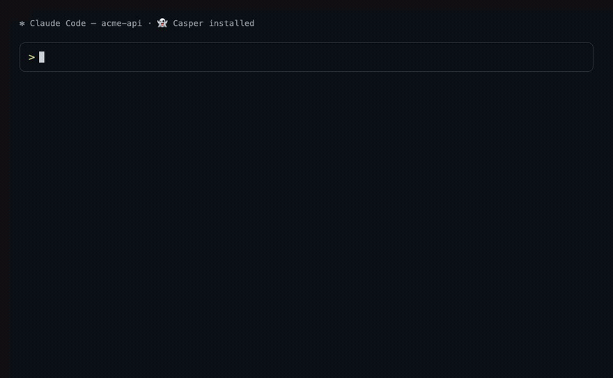
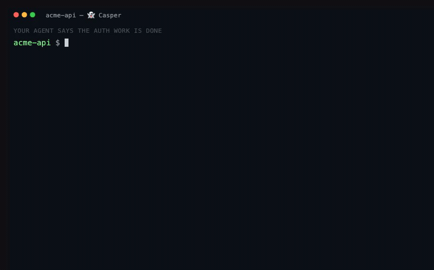
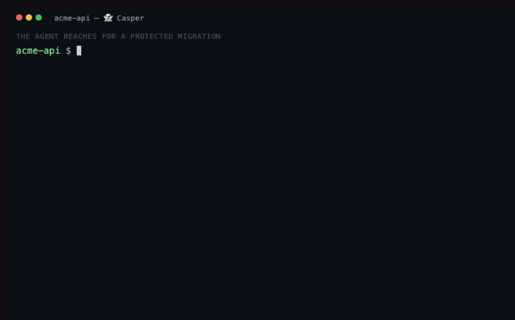
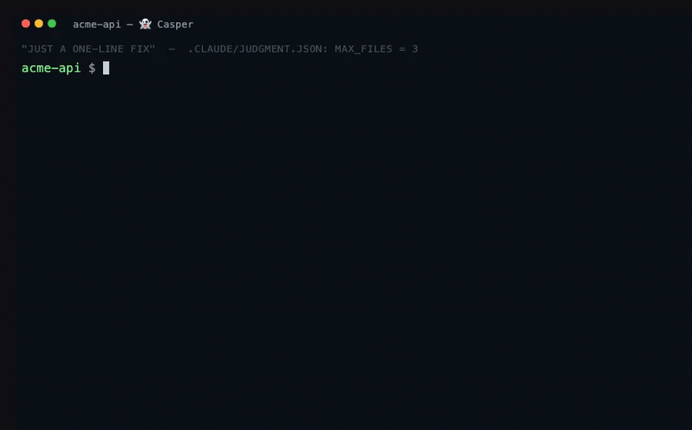
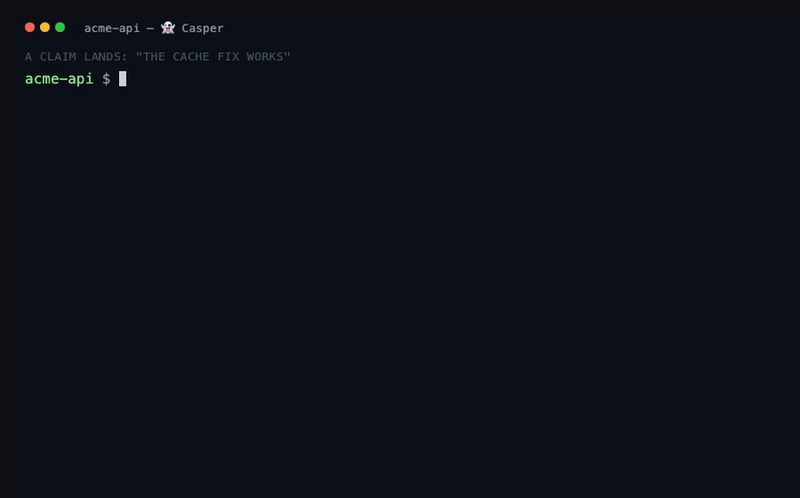
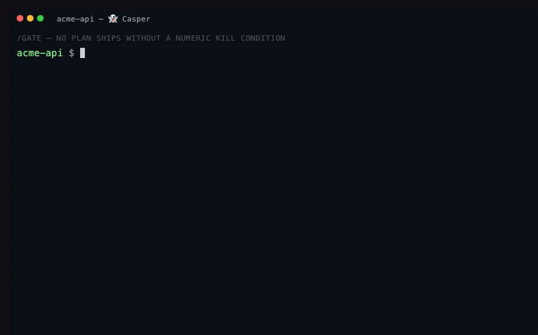
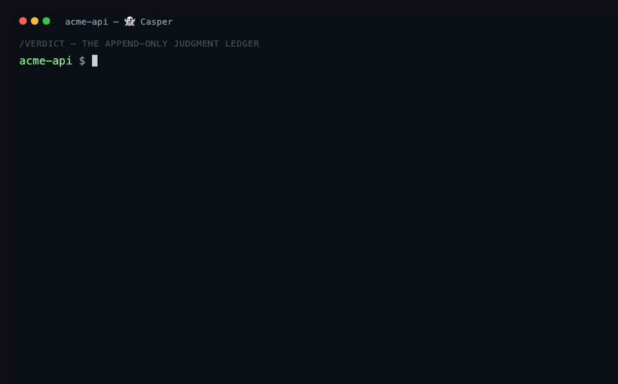
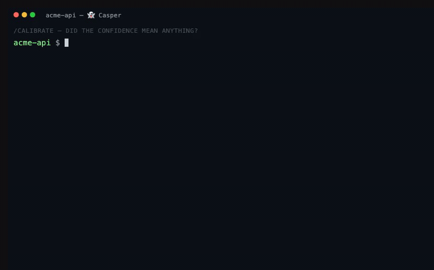

# Casper 👻

> **Your AI ghosted you with a "done." Casper caught it.**
>
> _The friendly ghost in your git — it keeps the receipts._

<p align="center"></p>

<!-- BADGES: numbers gated by scripts/check-counts.py (badge URLs can't hold COUNT markers — HTML comments break the link) -->
[](https://github.com/ronniepinnell/casper/actions/workflows/ci.yml) [](#the-judgment-toolkit) [](LICENSE) [](#the-judgment-toolkit) [](#the-full-collection) [](#)


A commit says `fix: done, all tests pass` — but zero tests ran. That's your AI
**ghosting** you: it claims it's finished and vanishes, leaving you the broken
code. Casper is the friendly ghost that catches it — when a "done" has no proof,
it blocks the commit and says:

```
👻 Boo — that ain't done yet.
   claim-evidence gate: this commit claims completion but has no evidence attached.
```

**Casper** is a curated set of Claude Code skills + agents built around one
thesis: **correction history is the asset, not the model.** Its headline act is the **judgment
toolkit** — <!-- COUNT: judgment-skills -->13<!-- /COUNT --> skills + <!-- COUNT: hooks -->7<!-- /COUNT --> CI-tested, zero-LLM hooks that block unproven "done"
claims, keep an append-only verdict ledger, and score how your confidence aged.
Around it sits a browsable **collection** of the planning, verification, and
tooling skills we actually run in production.

## 30-second quickstart

```bash
npx casper@latest              # interactive installer — mirrors install.sh, no clone needed
```

That one line is the fast path. Prefer a plugin? `/plugin marketplace add
ronniepinnell/casper` then `/plugin install casper`. Or clone and run the script
directly (install.sh is the floor everything else wraps):

```bash
git clone https://github.com/ronniepinnell/casper && cd casper

./install.sh --only refute              # one skill, into ./.claude/skills of this project
./install.sh                            # the whole judgment toolkit (13 skills)
./install.sh --all                      # toolkit + the entire collection (skills + agents)
```

`npx casper@latest --all` / `--only <name>` / `--category <name>` / `--hooks` /
`uninstall` all forward straight to install.sh. Then, inside Claude Code:
`/refute the login fix works`.

Non-invasive by design: `install.sh` copies only what you ask into
`.claude/` (`--global` for `~/.claude`), writes a manifest, and `./uninstall.sh`
reverts byte-for-byte exactly what was installed. `--dry-run` shows the plan
without touching anything. Hooks are separate and **default-OFF**
(`./install.sh --hooks`).

Check an install with `./scripts/doctor.sh` (a ✓/✗ diagnostic: judgment.json
valid? hooks wired? ledger writable? which gates are on?). Brag about your
receipts with `./scripts/share.sh` — it reads the ledger and prints one
copy-pasteable line (e.g. _"👻 Casper caught a fake 'done' — 3rd this week. 2
gate overrides, 0 in 6 days."_).

## Add it to your existing repo

The hooks are the enforcement, and they ship **default-OFF**. Three lines turn
them on, tuned to your stack:

```bash
cd your-project
npx casper@latest --init     # detects your stack, writes a tuned .claude/judgment.json, wires the hooks ON
casper doctor                # verify: judgment.json valid? hooks wired? ledger writable? which gates on?
```

That's it — from now on an evidence-free `git commit -m "fix: done"` is blocked
**in your repo**, and every verdict lands in `.claude/verdicts.log`. `--init`
asks at most 3 questions (confirm the protected paths for your stack, enable the
dangerous-git guard, start the ledger); everything else is detected. Commit
`.claude/judgment.json` so your whole team gets the same gates.

Casper works on **three surfaces** — use one or all:

| Surface | What it guards | How to add |
|---|---|---|
| **Local hooks** (this repo) | your commits + edits, before they happen | `npx casper@latest --init` |
| **Pull requests** | every PR, where teammates can't `--no-verify` past it | add the [refute-action](https://github.com/ronniepinnell/refute-action) GitHub Action (one `uses:` block) |
| **Model context** | let any model query your correction history mid-task | connect [casper-ledger-mcp](https://github.com/ronniepinnell/casper-ledger-mcp) (`claude mcp add`) |

Nothing is invasive: `./uninstall.sh` reverts byte-for-byte, and `--dry-run`
shows the plan first.

## See each piece work

Every GIF below is real output — the hooks are the actual scripts run against a real repo; the ledger and calibration frames are real tool output.

**In your editor** — `/refute` breaks a claim inside Claude Code and logs the verdict:



**The zero-LLM hooks** (git/CI, no model, no network):

| Hook | What it catches |
|---|---|
|  | **claim-evidence** — a "done" commit with no evidence is blocked, then passes once you attach proof. |
|  | **spec-citation** — editing a protected migration halts until you cite the governing spec. |
|  | **scope-creep** — a "one-line fix" quietly touching too many files trips the tripwire. |

**The skills** (procedure any model runs):

| Skill | |
|---|---|
|  | **/refute** — try to break the claim before believing it. |
|  | **/gate** — no plan without a numeric abort condition; watch it trip. |
|  | **/verdict** — every ruling is one grep-able line; "show every gate we overrode" is a query. |
|  | **/calibrate** — score how your confidence aged: *3 of 4 "done"s broke.* |

## The judgment toolkit

The flagship. <!-- COUNT: judgment-skills -->13<!-- /COUNT --> skills that turn "trust me, it's done" into a checkable record.

| Command | One-liner |
|---|---|
| `/refute` | Try to break the claim before believing it — CONFIRMED / REFUTED / UNVERIFIED |
| `/door` | Reversible? pick fast. Irreversible? enumerate the lock-in first |
| `/gate` | No plan without a numeric abort condition |
| `/drift` | Spec vs code-as-built — which one is lying? |
| `/altitude` | Fix at the cause's layer, not the symptom's |
| `/premortem` | It already failed — write the incident report first |
| `/think` | Forced thinking moves: invert, second-order, base-rate, analogy, flip, decompose |
| `/verdict` | Append-only judgment ledger — "every gate we overrode" is a grep |
| `/calibrate` | Score how your past confidence aged; corrections become mechanisms |
| `/escalate` | Queue the hard call, ship the rest; `burn` to batch-adjudicate |
| `/precedent` | Grep prior rulings: FOLLOW or explicitly DISTINGUISH |
| `/sweep` | Massive audit fan-out → adversarial verification → graded synthesis |
| `/judgment` | The map + router: given a situation, names the one tool that fits |

**Start here — 5 tools:** `/refute`, `/gate`, `/verdict`, `/door`, `/calibrate`.

Backed by <!-- COUNT: hooks -->7<!-- /COUNT --> zero-LLM hooks (claim-evidence, spec-citation, scope-creep,
dangerous-git, and three telemetry/guard hooks), each with a block-case AND
pass-case regression test — <!-- COUNT: hook-tests -->24<!-- /COUNT --> assertions, run in CI (`hooks/judgment/test.sh`).
Every skill appends a one-line, grep-able verdict to `.claude/verdicts.log`:

```bash
grep 'GATE.*OVERRIDE' .claude/verdicts.log   # every gate we overrode, with who signed it
```

Full deep-dive — thesis, operating loop, hook wiring, the ledger badge, weekly
digest — lives in **[MANUAL.md](MANUAL.md)**.

## The full collection

<!-- COUNT: collection-units -->54<!-- /COUNT --> authored units — <!-- COUNT: collection-skills -->41<!-- /COUNT --> skills + <!-- COUNT: collection-agents -->13<!-- /COUNT --> agents
(`origin: authored`, CI-checked provenance), organized into six categories. Each category page has a table — unit, what it does, when to
call, and a one-line install. Install one skill, a whole category, or everything.

| Category | What's inside | Units |
|---|---|---|
| [Planning & Lifecycle](collection/planning-and-lifecycle/README.md) | Initiative → milestone → epic → task cadence + orchestration | 11 |
| [Verification & Audit](collection/verification-and-audit/README.md) | Completion reality-checks, spec/rules conformance, bug hunts, over-engineering review | 18 |
| [Docs & Context](collection/docs-and-context/README.md) | Keep docs, AI-context files, and project records in sync | 4 |
| [Research & Analysis](collection/research-and-analysis/README.md) | Generate and pressure-test ideas, names, designs, decisions | 6 |
| [Meta & Tooling](collection/meta-and-tooling/README.md) | Scaffolding, session control, import/sync, dev-tool integrations | 13 |
| [Communication](collection/communication/README.md) | Hand work off cleanly — to the next session or another agent | 2 |

```bash
./install.sh --category verification-and-audit   # a whole category
./install.sh --only spec-audit,find-bugs         # pick individual units by name
```

## Docs

- **[MANUAL.md](MANUAL.md)** — the one deep doc: thesis, operating loop,
  authoring guide, skill-vs-hook decision tree, troubleshooting.
- **[CONTRIBUTING.md](CONTRIBUTING.md)** — how to add a unit; the collection flow.
- **[CHANGELOG.md](CHANGELOG.md)** — release history (Keep a Changelog format).
- **[ROADMAP.md](ROADMAP.md)** · **[LAUNCH.md](LAUNCH.md)**

## License

MIT © 2026 Ronnie Pinnell. All skills and agents are original authored work
(`origin: authored` frontmatter, CI-checked provenance).

---

Built by the team behind the autonomous software factory where these
procedures run in production. Casper is and stays free; if you want the hosted
verdict ledger, team calibration dashboards, or CI enforcement at org scale,
that's where they live.

---

_Casper is the free, friendly ghost — it watches your commits while you're away._
_Its bigger sibling runs the whole factory while you're gone._ 👻

<!-- demo change for the refute-action dogfood -->
